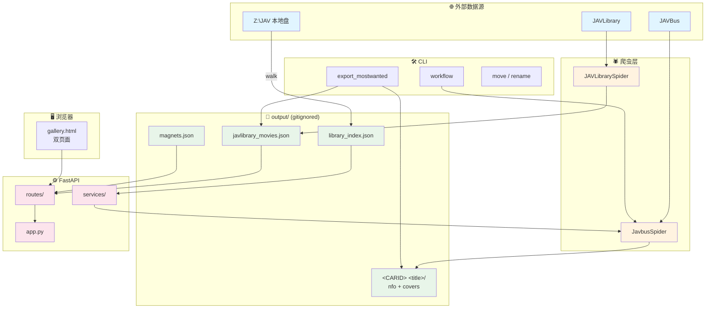
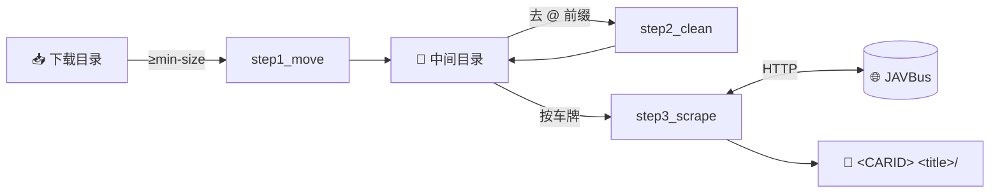

# JavlibraryScrapy

> Python 工具集：从 **JAVBus** 和 **JAVLibrary** 抓取成人视频元数据，生成 Kodi / Plex 兼容的 NFO。基于 [Scrapling](https://github.com/D4Vinci/Scrapling) 框架，支持 JS 渲染与 Cloudflare 绕过。

[](https://www.python.org/)
[](https://docs.astral.sh/uv/)
[](#)

---

## 目录

- [功能特性](#功能特性)
- [架构图](#架构图)
- [快速开始](#快速开始)
- [Console Scripts](#console-scripts)
- [模块一览](#模块一览)
- [配置 `.env`](#配置-env)
- [输出结构](#输出结构)
- [故障排除](#故障排除)
- [文档](#文档)
- [许可证](#许可证)

---

## 功能特性

| 模块 | 能力 |
| --- | --- |
| **JAVBus 爬虫** | 扫描视频目录 → 提取车牌 → 抓详情页元数据 → 生成 NFO + fanart/poster + 样品图 |
| **JAVLibrary 爬虫** | 翻页抓取 `vl_mostwanted.php` → 导出 JSON / CSV |
| **FastAPI 画廊** | Web UI 浏览影片库、勾选后一键抓磁力链接（HD+字幕 > HD > 标准 优先级） |
| **本地影片库** | 递归扫描 `LIBRARY_ROOT`，画廊页面对已下载影片打 badge |
| **端到端工作流** | 下载目录 → 大小过滤 → 去 `@` 前缀 → 抓取 → 输出 NFO |
| **PowerShell 工具** | Windows 后台启停画廊服务（PID + 日志），命名归一化 |

---

## 架构图

### 系统总览

四层结构：**爬虫 → 持久化 → 服务 → UI**。本地库作为正交子系统与所有层交互。



### 端到端 Workflow 流水线



### 画廊 3 个刷新按钮

| 按钮 | 触发 | 抓什么 | 写什么 | 耗时 |
|---|---|---|---|---|
| 🔄 手动刷新 | `/wanted` 顶栏 | 远端 Most Wanted + JAVBus 详情 | `javlibrary_movies.json` + 每部 cover.jpg | 5–15 min |
| 🔄 刷新库 | `/library` 顶栏 | 递归 walk `LIBRARY_ROOT` | `library_index.json` | 几秒 |
| ↻ 单部 | `/library` 卡片角 | 单部 JAVBus 详情 | 影片目录内 NFO + 封面 | 5–10 s/部 |

> 完整流程图（含 sequence 图）见 [`docs/refresh-flows.md`](docs/refresh-flows.md)

### 截图 / UI 示意

实际截图需要启动画廊服务后在浏览器中查看：

```bash
uv run python -m javlibraryscrapy.cli.gallery --open-browser
# 浏览器访问 http://localhost:8000/wanted 和 http://localhost:8000/library
```

UI 状态机详见 [`docs/library-feature.md`](docs/library-feature.md#25-ui-状态机q21-我自己定)。

---

## 快速开始

```bash
# 1. 安装依赖
uv sync

# 2. 复制环境变量样例并按需修改
cp .env.example .env   # Windows: copy .env.example .env

# 3. 选择一条跑通
#    交互式扫描本地视频目录、抓 JAVBus 元数据
uv run python -m javlibraryscrapy.scraping.javbus

#    抓 JAVLibrary Most Wanted 列表
uv run python -m javlibraryscrapy.scraping.javlibrary

#    端到端流水线：移动 → 改名 → 抓取
uv run python -m javlibraryscrapy.cli.workflow <下载路径> <中间路径> <输出路径>

#    启动 FastAPI 画廊（浏览器访问 http://localhost:8000）
uv run python -m javlibraryscrapy.cli.gallery --open-browser
```

> 首次运行会下载 Scrapling 的 Chromium（约 300 MB）。如果已安装 Chrome，可执行 `uv run playwright install chrome` 并在爬虫中启用 `real_chrome=True`。

---

## Console Scripts

`uv sync` 之后这些命令会出现在 `PATH` 里（来自 `pyproject.toml [project.scripts]`）：

| 命令 | 等价模块调用 | 作用 |
| --- | --- | --- |
| `javlibraryscrapy-gallery` | `python -m javlibraryscrapy.cli.gallery` | 启动 FastAPI 画廊 |
| `javlibraryscrapy-export` | `python -m javlibraryscrapy.cli.export_mostwanted` | 把 Most Wanted 导出到本地库 |
| `javlibraryscrapy-workflow` | `python -m javlibraryscrapy.cli.workflow` | 端到端流水线 |
| `javlibraryscrapy-move` | `python -m javlibraryscrapy.cli.move_videos` | 按大小过滤移动视频 |
| `javlibraryscrapy-rename` | `python -m javlibraryscrapy.cli.rename_at_symbol` | 去除文件名 `@` 前缀 |

---

## 模块一览

### 爬虫 (`src/javlibraryscrapy/scraping/`)

- **`javbus.py`** — `JavbusSpider`：扫描视频目录，提取车牌，通过 `AsyncDynamicSession` 抓 JAVBus 详情页，下载封面 + 样品图，在 `<root>/<CARID> <title>/` 下生成 NFO + poster/fanart。`download_cover()` 使用 `requests` + `Referer` 头绕过图片 CDN 防盗链。
- **`javlibrary.py`** — `JAVLibrarySpider`：抓取 `vl_mostwanted.php`，自动检测总页数（页间休眠 3 秒），输出 `output/javlibrary_movies.{json,csv}`。使用 `stealth_mode=True` + 90 秒超时应对 Cloudflare。

### CLI 工具 (`src/javlibraryscrapy/cli/`)

| 文件 | 作用 |
| --- | --- |
| `gallery.py` | FastAPI 画廊 CLI 入口（argparse + uvicorn.run） |
| `export_mostwanted.py` | 把 `javlibrary_movies.json` 导出到本地库（每部一个 `<CARID> <title>/`） |
| `workflow.py` | 三步流水线：移动 → 去 `@` → 抓取 → 输出 NFO |
| `move_videos.py` | 按 `--min-size` 过滤移动视频（≥100 MB 走 `robocopy`） |
| `rename_at_symbol.py` | 去除文件名 `@site.com@` 前缀 |

### 本地影片库 (`src/javlibraryscrapy/library/`)

- **`scanner.py`** — 递归扫描 `LIBRARY_ROOT`，对每个含视频文件的目录停止下钻。前缀匹配查找（`a.startswith(b) or b.startswith(a)`），优先返回更长命中。

```bash
# 离线生成索引（画廊启动时会自动按需扫描）
uv run python -m javlibraryscrapy.library.scanner --root "Z:\JAV" --index output/library_index.json
```

### FastAPI 服务 (`src/javlibraryscrapy/server/`)

重构后的画廊实现：`app.py`（`create_app()` 工厂 + `local_ip_address()`）+ `config.py`（pydantic-settings）+ `models.py` + `services/`（`jobs`、`jobs_runner`、`wanted`、`wanted_refresh`、`library`、`covers`）+ `routes/`（按资源拆分的 HTTP 层）。

关键行为：
- 同一时刻只允许一个抓取任务（第二次提交返回 409）
- 后台线程跑 `MagnetSpider(JavbusSpider)`，进度通过 `ScrapeJob` 状态机 + `JobLogHandler` 实时回传
- 模板 `src/javlibraryscrapy/templates/gallery.html` 从磁盘读取，改完刷新即生效

### PowerShell 脚本 (`scripts/`)

Windows 用户的后台运维：

```powershell
# 后台启停画廊服务（PID + 日志持久化到 output/）
pwsh scripts/Start-GalleryServer.ps1 -Action Start
pwsh scripts/Start-GalleryServer.ps1 -Action Status
pwsh scripts/Start-GalleryServer.ps1 -Action Stop
pwsh scripts/Start-GalleryServer.ps1 -Action Restart

# 把本地库的旧命名（如 "<carid> <title>-poster.jpg"）归一为标准名
pwsh scripts/Sync-LibraryCoverNames.ps1 -LibraryRoot "Z:\JAV" -DryRun
pwsh scripts/Sync-LibraryCoverNames.ps1 -LibraryRoot "Z:\JAV" -Force

# wanted JSON 误删/回滚后的恢复工具
uv run python scripts/restore_wanted_from_folders.py --mw-root "Z:\JAV\MostWanted" --dry-run
```

---

## 配置 `.env`

```env
# JAVBus
JAVBUS_URL=https://www.javbus.com

# JAVLibrary 入口（默认 c99i.com 镜像；切镜像/换回原站时改这里）
JAVLIBRARY_URL=https://www.c99i.com/cn/vl_mostwanted.php

# 代理（大多数地区必需）
PROXY=http://127.0.0.1:10808
PROXY_JAVBUS_ENABLED=false
PROXY_JAVLIBRARY_ENABLED=false

# Scrapling（毫秒；JAVLibrary 内部固定 90 秒）
SCRAPLING_LOAD_DOM=true
SCRAPLING_NETWORK_IDLE=true
SCRAPLING_DISABLE_RESOURCES=true
SCRAPLING_HEADLESS=true
SCRAPLING_TIMEOUT=30000

# 本地影片库（不设则禁用本地库功能）
LIBRARY_ROOT=Z:\JAV
LIBRARY_INDEX=output/library_index.json

# HTTP
USER_AGENT=Mozilla/5.0 (...)
DOWNLOAD_TIMEOUT=10
VERIFY_SSL=false
```

完整字段说明见 [`CLAUDE.md`](CLAUDE.md) 的「配置」一节。

---

## 输出结构

```
output/
├── javlibrary_movies.json          # JAVLibrary 爬虫结果（gitignored）
├── javlibrary_movies.csv
├── magnets.json                    # 批量磁力抓取结果（含 status / library_folder）
├── magnets_links.txt               # 纯磁力链接（粘贴到下载器）
├── library_index.json              # 本地库索引（gitignored）
├── .cover_cache/                   # 服务端封面代理缓存（gitignored）
└── <CARID> <title>/                # 每个视频一个文件夹
    ├── <prefix>.mp4
    ├── <prefix>.nfo                # Kodi/Plex 元数据
    ├── fanart.png                  # 封面原图
    ├── poster.png                  # 5:7 海报（fanart 右边缘裁剪）
    ├── <CARID>_sample_NNN.jpg      # JAVBus 樣品圖像
    └── <CARID>_debug.html          # 调试用，仅在出错时生成
```

> �️ 整个 `output/` 都在 `.gitignore` 里，包括 `javlibrary_movies.json` —— `git rm` / `git reset` / 分支回滚都可能丢数据。若被误删，用 `scripts/restore_wanted_from_folders.py` 从本地库的 `<CODE> <title>/` folder 反推。

---

## 故障排除

### 封面下载 403 Forbidden

**原因**：缺少或不正确的 `Referer` 头，JAVBus 图片 CDN 直接拒绝。

**解决**：检查 `JAVBUS_URL` 配置正确；`Referer` 头必须指向视频详情页（即 `<JAVBUS_URL><car_id>`）。`JavbusSpider.download_cover()` 已处理此头，**不要**用其他 HTTP 客户端覆盖。

### JS 内容没加载出来

**原因**：浏览器超时或网络抖动。

**解决**：调高 `SCRAPLING_TIMEOUT`（毫秒）。JAVLibrary 由于要过 Cloudflare，内部固定 90 秒。出错时同目录会有 `<CARID>_debug.html`，可用 `tests/unit/verify_parsing.py` 离线解析。

### 磁力没拿到

**原因**：详情页结构差异（部分画廊页没有 `a.magnet-link` class）。

**解决**：`JavbusSpider._extract_magnet_link` 已加全文正则回退，无需手动调整。

### 本地库扫描误判 root 不一致

**原因**：`LIBRARY_ROOT` 用了映射盘（`Z:\JAV`），索引里是 UNC（`\\nas\JAV`），形参不同但物理路径一致。

**解决**：服务在扫描 / 查询时统一走路径归一化（commit `c0ab1d7`），不应再触发强制重扫。若仍触发，检查启动日志的归一化结果。

更多内容见 [`scripts/README.md`](scripts/README.md) 和 [`CLAUDE.md`](CLAUDE.md)。

---

## 文档

- [`CLAUDE.md`](CLAUDE.md) — 给 Claude Code 用的项目事实源（架构 / 命令 / 关键 commit）
- [`docs/library-feature.md`](docs/library-feature.md) — 本地影片库功能设计文档
- [`docs/refresh-flows.md`](docs/refresh-flows.md) — 画廊的 3 个刷新按钮工作流（手动刷新 / 刷新库 / 单部 ↻）
- [`docs/archive/`](docs/archive/) — 历史开发文档（Scrapling 迁移、403 排查等）

---

## 许可证

本项目**仅供学习教育使用**。

- 尊重网站服务条款与 `robots.txt`
- 使用反检测措施（真实 UA、正确标头、受控速率）
- 生成的元数据兼容 Kodi、Plex 等媒体中心软件
