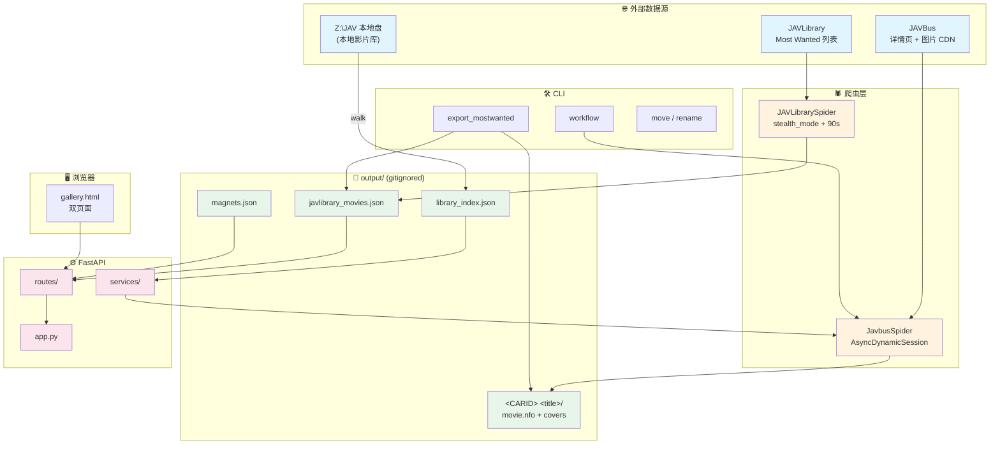
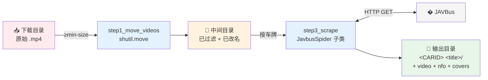
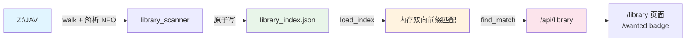

# JavlibraryScrapy

> Python 工具集：从 **JAVBus** 和 **JAVLibrary** 抓取成人视频元数据，生成 Kodi / Plex 兼容的 NFO。基于 [Scrapling](https://github.com/D4Vinci/Scrapling) 框架，支持 JS 渲染与 Cloudflare 绕过。

**状态**：✨ 已用 Scrapling 重写，可靠性和性能显著提升；附带 FastAPI 画廊、本地库扫描、PowerShell 后台运维。

---

## 目录

- [功能特性](#功能特性)
- [架构图](#架构图)
- [需求](#需求)
- [安装](#安装)
- [使用方法](#使用方法)
- [架构](#架构)
- [技术细节](#技术细节)
- [故障排除](#故障排除)
- [开发与调试](#开发与调试)
- [相关项目](#相关项目)
- [许可证与注意事项](#许可证与注意事项)

---

## 功能特性

### 爬虫

- **双数据源**：JAVBus（按车牌抓详情）和 JAVLibrary（Most Wanted 多页列表）
- **动态内容处理**：Scrapling `AsyncDynamicSession` + Chromium，JS 渲染 + Cloudflare 绕过
- **元数据提取**：标题、发行日期、制作商、发行商、类别、演员、封面 URL、样品图 URL 列表、磁力链接
- **图片下载**：自动下载封面 + 樣品圖像，使用正确的 `Referer` 头绕过防盗链
- **NFO 生成**：Kodi / Plex 兼容的 XML 元数据
- **海报处理**：自动从 fanart 右边缘裁剪 5:7 海报
- **磁链优先级**：`HD + 字幕` > `HD` > `标准`，命中最高优先级短路循环
- **代理支持**：内置 HTTP / HTTPS / SOCKS5 代理
- **错误处理**：全面日志 + 调试 HTML 落盘

### 端到端流水线

- **CLI 工作流**（`cli/workflow.py`）：移动大视频 → 去 `@` 前缀 → 抓取 → 输出 NFO
- **本地库扫描**（`library/scanner.py`）：递归扫描已下载影片，画廊页面对已下载车牌打 badge
- **FastAPI 画廊**（`server/` + `cli/gallery.py`）：Web UI 浏览、勾选、一键抓磁力
- **PowerShell 后台运维**：`Start-GalleryServer.ps1`（PID + 日志启停）、`Sync-LibraryCoverNames.ps1`（命名归一）
- **数据恢复**：`scripts/restore_wanted_from_folders.py` —— wanted JSON 误删时从本地库 folder 反推

---

## 架构图

### 系统总览

四层结构：**爬虫（外网） → 持久化（output/） → 服务（FastAPI） → UI（浏览器）**。本地库作为正交子系统与所有层交互。



### 端到端 Workflow 流水线



### 画廊 3 个刷新按钮

| 按钮 | 触发 | 抓什么 | 写什么 | 耗时 |
|---|---|---|---|---|
| 🔄 **手动刷新** | `/wanted` 顶栏 | 远端 Most Wanted + JAVBus 详情 | `javlibrary_movies.json` + 每部 cover.jpg | 5–15 min |
| 🔄 **刷新库** | `/library` 顶栏 | 递归 walk `LIBRARY_ROOT` | `library_index.json` | 几秒 |
| ↻ **单部** | `/library` 卡片角 | 单部 JAVBus 详情 | 影片目录内 NFO + 封面 | 5–10 s/部 |

> 完整 sequence 图见 [`docs/refresh-flows.md`](docs/refresh-flows.md)

### 本地库数据流



### 截图 / UI 示意

实际截图需要启动画廊服务后在浏览器中查看：

```bash
uv run python -m javlibraryscrapy.cli.gallery --open-browser
# 浏览器访问 http://localhost:8000/wanted 和 http://localhost:8000/library
```

UI 状态机（6 个状态：loading-initial / loading-rescan / empty / error / normal / search-empty）详见 [`docs/library-feature.md`](docs/library-feature.md#25-ui-状态机q21-我自己定)。

---

## 需求

- **Python** 3.11+
- **[uv](https://docs.astral.sh/uv/)** 包管理器
- **代理**（从大多数地区访问 JAVBus / JAVLibrary 必需）
- **Windows / macOS / Linux** 均可（工作流里 `robocopy` 处理大文件，`scripts/` 下还有 PowerShell 脚本）

---

## 安装

### 1. 克隆仓库

```bash
git clone https://github.com/IzumiHoshi/JavlibraryScrapy.git
cd JavlibraryScrapy
```

### 2. 使用 uv 安装依赖

```bash
uv sync
```

`pyproject.toml` 默认索引为阿里云 PyPI 镜像，`torch` 从 NJU 镜像拉取（显式 override）。在镜像不可达的网络环境下可用 `UV_INDEX_URL` 覆盖。会装上：

- `scrapling[all]` —— Web 爬虫框架
- `python-dotenv` —— 环境变量管理
- `lxml` —— XML 处理
- `Pillow` —— 图像处理
- `fastapi` / `starlette` / `uvicorn` / `pydantic` / `pydantic-settings` —— FastAPI 画廊

### 3. 初始化 Scrapling（仅首次需要）

```bash
uv run python -c "from scrapling.fetchers import DynamicFetcher; print('Scrapling initialized')"
```

此命令会下载并安装 Chromium（~300 MB）。若已安装 Chrome 想用它：

```bash
uv run playwright install chrome
```

然后在爬虫配置里设 `real_chrome=True`。

### 4. 配置环境

在根目录创建 `.env`：

```env
# JAVBus
JAVBUS_URL=https://www.javbus.com

# JAVLibrary 入口（默认 c99i.com 镜像；切镜像/换回原站时改这里）
JAVLIBRARY_URL=https://www.c99i.com/cn/vl_mostwanted.php

# 代理（大多数地区必需）
PROXY=http://127.0.0.1:10808
PROXY_JAVBUS_ENABLED=false
PROXY_JAVLIBRARY_ENABLED=false

# Scrapling
SCRAPLING_LOAD_DOM=true
SCRAPLING_NETWORK_IDLE=true
SCRAPLING_DISABLE_RESOURCES=true
SCRAPLING_HEADLESS=true
SCRAPLING_TIMEOUT=30000

# 本地影片库（不设则禁用本地库功能）
LIBRARY_ROOT=Z:\JAV
LIBRARY_INDEX=output/library_index.json

# HTTP
USER_AGENT=Mozilla/5.0 (...)
DOWNLOAD_TIMEOUT=10
VERIFY_SSL=false
```

> JAVLibrary 在 `main()` 中直接读取 `JAVLIBRARY_URL` / `PROXY_JAVLIBRARY_ENABLED` / `PROXY`，忽略 Scrapling 前缀的变量。`SCRAPLING_TIMEOUT` 默认 30000ms，JAVLibrary 内部固定 90 秒。

---

## 使用方法

### Console Scripts（`uv sync` 后即在 `PATH` 中）

| 命令 | 等价模块调用 | 作用 |
| --- | --- | --- |
| `javlibraryscrapy-gallery` | `python -m javlibraryscrapy.cli.gallery` | 启动 FastAPI 画廊 |
| `javlibraryscrapy-export` | `python -m javlibraryscrapy.cli.export_mostwanted` | 把 Most Wanted 导出到本地库 |
| `javlibraryscrapy-workflow` | `python -m javlibraryscrapy.cli.workflow` | 端到端流水线 |
| `javlibraryscrapy-move` | `python -m javlibraryscrapy.cli.move_videos` | 按大小过滤移动视频 |
| `javlibraryscrapy-rename` | `python -m javlibraryscrapy.cli.rename_at_symbol` | 去除文件名 `@` 前缀 |

### 1. JAVBus 爬虫 —— 按车牌抓详情页

```bash
uv run python -m javlibraryscrapy.scraping.javbus
```

按提示输入视频目录路径：

```
请输入视频目录路径：C:\Videos\MyCollection
```

脚本流程：
1. 查找所有视频文件并提取车牌（如 `ABF-340`）
2. 从 JAVBus 获取每个视频的元数据
3. 下载封面 + 樣品圖像（带正确 `Referer` 头绕过防盗链）
4. 生成 Kodi 兼容的 NFO
5. 从 fanart 裁剪 5:7 海报
6. 用元数据组织到子目录

### 2. JAVLibrary 爬虫 —— 抓 Most Wanted 列表

```bash
uv run python -m javlibraryscrapy.scraping.javlibrary
```

输出 `output/javlibrary_movies.json` + `output/javlibrary_movies.csv`。自动检测总页数，页间休眠 3 秒，使用 `stealth_mode=True` + 90 秒超时应对 Cloudflare。

### 3. 端到端工作流

```bash
uv run python -m javlibraryscrapy.cli.workflow <下载路径> <中间路径> <输出路径> [--min-size 500] [--preview]
```

三步流水线：
1. **移动**：`shutil.move`（不用 robocopy）将 ≥`--min-size` MB 的文件从下载路径移到中间路径
2. **改名**：去除中间路径中文件名的 `@` 前缀（`--preview` 模式下仅记录）
3. **抓取**：子类化 `JavbusSpider`，每个车牌在输出路径下建独立子目录 `<CARID> <title>/`，视频移入、写 NFO，封面复制为 `fanart.png` 再裁剪为 `poster.png`

`--preview` 仅执行步骤 1–2，到抓取步骤前停止。

### 4. FastAPI 画廊

```bash
uv run python -m javlibraryscrapy.cli.gallery [--port 8000] [--data output/javlibrary_movies.json] [--open-browser]
```

默认监听 `0.0.0.0:8000`，同一局域网可通过启动日志显示的地址访问，例如 `http://192.168.0.116:8000`。如果 Windows 防火墙弹出提示，请允许 Python 在「专用网络」中通信。

**页面功能：**

- 卡片展示封面、车牌、标题；点卡片任意位置勾选（选中状态存浏览器 localStorage，刷新不丢）
- 搜索框按车牌/标题过滤；「全选 / 清空 / 反选」作用于当前过滤结果
- **抓取选中的磁力** —— 调用 `JavbusSpider.crawl_and_process`，右侧面板显示实时进度、日志、每个车牌的结果，可单条或整批复制磁力链接
- **导出 code** —— 把选中的车牌下载成 `selected_codes.txt`（不联网，纯浏览器侧导出）
- 抓完可「重试失败项」，只重跑没拿到磁力的车牌
- **双页面**：顶部导航切换 `/wanted`（爬取结果）和 `/library`（本地库），共用海报灯箱组件

**输出文件：**

| 文件 | 内容 |
| --- | --- |
| `output/magnets.json` | 车牌、标题、磁力、状态、发行日期、演员、JAVBus 链接（含 `status=local_skip`） |
| `output/magnets_links.txt` | 纯磁力链接，每行一条，可整体粘进下载器 |

每次抓取都会覆盖写入。

**参数：**

- `--data` 影片数据文件（默认 `output/javlibrary_movies.json`，缺失回退同名 `.csv`）
- `--output-dir` 结果输出目录（默认 `output/`）
- `--host` / `--port` 监听地址与端口（默认 `0.0.0.0:8000`，允许局域网访问）
- `--image-proxy {auto,on,off}` 封面是否经服务端代理拉取。`auto`（默认）在 `.env` 里 `PROXY_JAVBUS_ENABLED=true` 时启用；封面缓存在 `output/.cover_cache/`
- `--library-root` 本地库根目录（需在 `.env` 配置 `LIBRARY_ROOT`，否则禁用本地库功能）
- `--open-browser` 启动后自动打开浏览器（默认不打开）

**后台启停（Windows）：**

```powershell
pwsh scripts/Start-GalleryServer.ps1 -Action Start      # 后台启动（pythonw）
pwsh scripts/Start-GalleryServer.ps1 -Action Status     # 显示 PID/内存/端点探活/最近日志
pwsh scripts/Start-GalleryServer.ps1 -Action Stop       # 优雅停止（PID 文件 + 端口双定位）
pwsh scripts/Start-GalleryServer.ps1 -Action Restart    # Stop 后自动 Start

# 自定义参数
pwsh scripts/Start-GalleryServer.ps1 -Action Start -Port 8080 -LibraryRoot "Z:\JAV" -OpenBrowser
```

### 5. Most Wanted 导出到本地库

```bash
# 读取默认 output/javlibrary_movies.json，导出到 .env 的 MOSTWANTED_LIBRARY_ROOT
uv run python -m javlibraryscrapy.cli.export_mostwanted

# 显式指定路径
uv run python -m javlibraryscrapy.cli.export_mostwanted \
  --source output/javlibrary_movies.json \
  --library-root "Z:\JAV\MostWanted"

# 强制覆盖已存在的文件夹
uv run python -m javlibraryscrapy.cli.export_mostwanted --overwrite

# 只打印计划，不写文件
uv run python -m javlibraryscrapy.cli.export_mostwanted --dry-run

# 调试：只处理前 5 部
uv run python -m javlibraryscrapy.cli.export_mostwanted --limit 5

# 只下 poster.jpg（不拉 JAVBus）
uv run python -m javlibraryscrapy.cli.export_mostwanted --skip-javbus
```

每部影片建 `<root>/<CARID> <title>/`，内含：

- `movie.nfo` —— 从 JAVBus 详情页抓到的完整元数据
- `poster.jpg` —— JAVLibrary 列表的竖版缩略图
- `fanart.jpg` —— JAVBus 详情页的横版原图

复用 `JavbusSpider` 处理 JAVBus 部分，只覆写 `process_movie` 把 `fanart.png → fanart.jpg`、NFO 改名 `movie.nfo`、不做 poster/fanart 拆分。**排除列表**：`HEYZO / PONDO / CARIB / OKYOHOT`（这些在 JAVBus 上没页面）。

### 6. 视频处理工具

```bash
# 按大小过滤移动视频（≥100 MB 走 robocopy 显示进度）
uv run python -m javlibraryscrapy.cli.move_videos <source> <destination> [--min-size 500]

# 去除文件名 @site.com@ 前缀（hkbisi.com@ABF-340-C.mp4 → ABF-340-C.mp4）
uv run python -m javlibraryscrapy.cli.rename_at_symbol <path> [--preview]
```

### 7. 本地影片库（独立使用）

```bash
uv run python -m javlibraryscrapy.library.scanner --root "Z:\JAV" --index output/library_index.json
```

独立模块，提供：
- `scan_library(root)` —— 递归扫描 `root`（策略：遇到任一含视频文件的目录就停止深入）
- `LibraryIndex.find_match(code)` —— **双向前缀匹配**（`a.startswith(b) or b.startswith(a)`），优先返回更长命中
- `save_index` / `load_index` —— 原子写入 + 加载 `output/library_index.json`（schema_version=1）

命名归一化（一次性工具，把本地库的旧命名复制成标准名）：

```powershell
pwsh scripts/Sync-LibraryCoverNames.ps1 -LibraryRoot "Z:\JAV" -DryRun
pwsh scripts/Sync-LibraryCoverNames.ps1 -LibraryRoot "Z:\JAV" -Force
```

### 8. 误删 wanted JSON 的恢复

⚠️ **只在 wanted JSON 误删/回滚后用**。`output/javlibrary_movies.json` 不进 git（`output/` 整个被 gitignore）；若被 `git reset` 或分支切换弄丢，NFS 上 `<MOSTWANTED_LIBRARY_ROOT>/<CODE> <title>/` folder 仍在，本脚本可反推 JSON。

```bash
uv run python scripts/restore_wanted_from_folders.py [--dry-run]
uv run python scripts/restore_wanted_from_folders.py --mw-root "Z:\JAV\MostWanted"
uv run python scripts/restore_wanted_from_folders.py --json "D:\backup\javlibrary_movies.json"
```

行为：
- 扫 `mw_root` 下所有 `<CODE> <title>/` folder
- 已存在 JSON 的 code 跳过（保留最新抓取数据）
- 不存在的 code 写入 JSON，标记 `_restored_from_folder=true`、`_bucket=unknown`、`missing_in_remote=true`
- `release_date` 留空（NFS mtime 不可信），下次 `refresh_wanted` 触发时 `merge_wanted` 会看到空 → 自动加进 `needs_javbus` → 重抓补回真实日期

---

## 输出结构

### 单视频目录

```
C:\Videos\MyCollection\
├── ABF-340 性欲に支配された倒錯カップルの同棲中出し性交録。 瀧本�葉\
│   ├── ABF-340 性欲に...mp4 (原始视频文件)
│   ├── ABF-340 性欲に...nfo (Kodi 元数据)
│   ├── ABF-340 性欲に...-fanart.png (封面艺术)
│   └── ABF-340 性欲に...-poster.png (海报缩略图)
```

### 生成的 NFO 示例

```xml
<?xml version="1.0" encoding="UTF-8" standalone="yes"?>
<movie>
  <title>性欲に支配された倒錯カップルの同棲中出し性交録。</title>
  <id>ABF-340</id>
  <director>プレステージ</director>
  <studio>プレステージ</studio>
  <premiered>2026-04-17</premiered>
  <genre>フルハイビジョン(FHD)</genre>
  <genre>巨乳</genre>
  <actor>
    <name>瀧本雫葉</name>
  </actor>
</movie>
```

### 全局 output 目录

```
output/
├── javlibrary_movies.json          # JAVLibrary 爬虫结果（gitignored）
├── javlibrary_movies.csv
├── magnets.json                    # 批量磁力抓取结果（含 status / library_folder）
├── magnets_links.txt               # 纯磁力链接（粘贴到下载器）
├── library_index.json              # 本地库索引（gitignored）
├── .cover_cache/                   # 服务端封面代理缓存（gitignored）
├── .gallery_server.pid             # 画廊后台进程 PID
├── .gallery_server.log             # 画廊后台日志
└── <CARID> <title>/                # 每个视频一个文件夹（见上）
```

> ⚠️ 整个 `output/` 都在 `.gitignore` 里，包括 `javlibrary_movies.json` —— `git rm` / `git reset` / 分支回滚都可能丢数据。误删时用 `scripts/restore_wanted_from_folders.py` 恢复。

---

## 架构

### 爬虫（顶层入口）

- **`src/javlibraryscrapy/scraping/javbus.py`** — `JavbusSpider`：扫描视频目录，提取车牌，通过 `AsyncDynamicSession` 抓 JAVBus 详情页，下载封面 + 样品图，在 `<root>/<CARID> <title>/` 下生成 NFO + poster/fanart。
  - `parse()` 提取标题、发行日期、制作商/发行商、类别、演员、封面 URL、**樣品圖像 URL 列表**（`#sample-waterfall a.sample-box[href]`）和磁力链接（`_extract_magnet_link` 中按 HD+字幕 > HD > 标准 优先级）。
  - **`download_cover()`** 与新增的 **`download_samples()`**：cover 落地为 `<root>/<CARID>.png`；samples 落地为 `<root>/<CARID>_sample_NNN.jpg`（按 URL 顺序编号）。两者都带 JAVBus Referer 头，幂等（已存在跳过）。
  - **磁链解析鲁棒性**（commit `45e0d9a`）：`_extract_magnet_link` 优先尝试 `a.magnet-link` / `link-magnet` class；若页面里没有这些 class，回退到全文正则匹配 `magnet:?xt=urn:btih:...`，避免漏抓；解析过程会写 debug 日志便于追踪。
  - `download_cover()` 使用同步 `requests`（而非 Scrapling session）以便显式设置 `Referer` 头指向视频页面 —— 这是避免 403 的必需操作。
  - `process_movie()` 被 `cli/workflow.py` 子类化以重定向输出到不同目录（构造后设置 `spider.output_dir = output_path`；子类把封面复制到子目录，而不是原地重命名）。

- **`src/javlibraryscrapy/scraping/javlibrary.py`** — `JAVLibrarySpider`：爬取 JAVLibrary `vl_mostwanted.php`（或可配置的基础 URL），自动检测总页数，页间休眠 3 秒，导出 `movies.json` + `movies.csv`。使用 `stealth_mode=True` 和 90 秒超时以通过 Cloudflare 验证。

### 工具 (`src/javlibraryscrapy/utils/`)

- **`car.py`** — `find_car_bus(file, list_suren_car)` 从大写后的文件名中提取 JAVBus 车牌号。三个正则分支按优先级顺序：`T28-###`、`##ID-###`（如 `20ID-020`）、标准 `[A-Z]+-###`。从长后缀中去除前导零（`AVOP00127` → `AVOP-127`）。`find_car_bus` 内部硬编码的排除列表：`HEYZO`、`PONDO`、`CARIB`、`OKYOHOT`（这些在 JAVBus 上不存在页面）。`javbuscar(root_dir)` 包装器遍历目录，对每个视频调用 `find_car_bus(file, ["LUXU", "MIUM"])`。
- **`filesave.py`** — `write_xml(nfo_path, info)` 生成 Kodi/Plex NFO，硬编码 `mpaa=NC-17`、`countrycode=JP`、`country=日本`；按空格分割类别/演员；转义 XML。`rename()` 是 `Path.rename` 的安全包装，目标存在时 no-op。
- **`fanart.py`** — `split_poster_from_fanart(fanart, poster)` 从 fanart 的**右边缘**裁剪出 5:7 比例（JAVBus 海报叠在 fanart 右边的布局）。

### FastAPI 服务 (`src/javlibraryscrapy/server/`)

- `app.py` — `create_app()` 工厂 + `local_ip_address()`（局域网展示用）
- `config.py` — 从 `.env` 读取的 `Settings`（pydantic-settings）
- `models.py` — 请求/响应 Pydantic 模型（保留原服务的 JSON shape）
- `services/` — 业务逻辑：`jobs.py`（`ScrapeJob` 状态机 + `JobLogHandler`）、`jobs_runner.py`、`wanted.py`（wanted 列表）、`wanted_refresh.py`（单部刷新）、`library.py`（本地库查询 / 详情 / 报警）、`covers.py`（封面代理）
- `routes/` — HTTP 路由层：仅做请求解析 + 响应包装。模块按资源拆分：`movies`、`scrape`、`covers`、`folder`、`library`、`rescan`、`wanted`（合并 refresh + images）、`pages`

**关键行为**：

- 读取 `output/javlibrary_movies.json`（缺失回退 `.csv`），以卡片 + 复选框形式展示
- 勾选后点「抓取选中的磁力」，后端在**后台线程**里 `asyncio.run(MagnetSpider.crawl_and_process(...))`，结果写入 `output/magnets.json` + `output/magnets_links.txt`
- 同一时刻只允许一个任务（第二次提交返回 409）；`code` 必须匹配 `[A-Z0-9_-]{2,32}` 才会被拼进 URL
- `/api/cover?url=` 用 `requests` + `.env` 代理在服务端拉封面并缓存到 `output/.cover_cache/`
- **单部刷新**（commit `0471157`）：`wanted_refresh` 路由对单条车牌重新拉 JAVBus，可保留已选状态、避免整页重抓
- **路径归一化**（commit `c0ab1d7`）：用户传入的 `LIBRARY_ROOT` 和索引里已存的路径可能一个用映射盘（`Z:\JAV`）一个用 UNC（`\\nas\JAV`），形参上看着不一样但其实指向同一物理卷；服务启动 / 扫描 / 查询时统一走规范化比较，避免「索引被判定为 root 不一致 → 强制重扫」的误判

页面模板在 `src/javlibraryscrapy/templates/gallery.html`，每次请求从磁盘读取，改完刷新即生效，不用重启服务。模板同时承载 `/wanted`（爬取结果）和 `/library`（本地库）双页面 + 顶部导航 + 海报灯箱。

### 本地影片库 (`src/javlibraryscrapy/library/`)

- `scanner.py` — 独立模块，详见上文「本地影片库（独立使用）」一节
- 画廊集成（实际逻辑在 `src/javlibraryscrapy/server/` 包）：
  - `GalleryState.library_root` / `library_index` / `scan_state`：启动时按需加载索引（root 不一致则等手动刷新），后台线程扫描
  - `/library` 页面 + `/api/library*` 端点（列表/详情/状态/重扫/报警）；`/api/movies` 返回时附加 `local_exists` / `library_folder`
  - `/api/scrape` 自动跳过本地已存在的车牌（**不入 `magnets_links.txt`**，但 `magnets.json` v2 仍记录 `status=local_skip` 与 `library_folder`）
  - `/api/local-cover` 读本地 `poster.jpg`（按 poster/folder/cover 顺序自动挑选，受 `library_root` 越界检查保护）；`/api/open-folder` 调 `os.startfile` 打开目录

设计文档：[`docs/library-feature.md`](docs/library-feature.md)

### 端到端流水线 (`src/javlibraryscrapy/cli/workflow.py`)

三步流程（详见上文「端到端工作流」一节）：

1. `step1_move_videos()` — `shutil.move` 将 `download_path` 中所有 ≥`--min-size` MB 的文件移到 `intermediate_path`
2. `step2_clean_at_prefix()` — 去除 `intermediate_path` 中文件名的 `@` 前缀
3. `step3_scrape()` — 子类化 `JavbusSpider` 以重写 `process_movie()`：每个车牌在 `output_path` 下有独立子目录 `<CARID> <title>`

`--preview` 仅执行步骤 1–2，到抓取步骤前停止。

---

## 技术细节

### 浏览器配置

```python
async with AsyncDynamicSession(
    load_dom=True,              # 等待 JavaScript 加载
    network_idle=True,          # 等待网络空闲
    disable_resources=True,     # 跳过非必需资源（快 25%）
    proxy=self.proxy,           # 使用配置的代理
    headless=True,              # 在无界面模式运行
    timeout=30000,              # 30 秒超时
) as session:
```

### 图像下载头配置

```python
headers = {
    'User-Agent': 'Mozilla/5.0 (Windows NT 10.0; Win64; x64) ...',
    'Referer': f'{self.javbus_url}{car_id}',  # 对防盗链绕过至关重要
    'Accept': 'image/webp,image/apng,image/*,*/*;q=0.8',
}
```

### Cloudflare 绕过

- **JAVBus**：`AsyncDynamicSession` + `disable_resources=True`（快约 25%）+ 30 秒超时
- **JAVLibrary**：`stealth_mode=True` + `disable_resources=False` + 90 秒超时

### 文件名编码

所有 I/O 使用 UTF-8；车牌正则期望大写文件名。

### PyPI 镜像

`pyproject.toml` 默认索引为阿里云 PyPI 镜像，`torch` 从 NJU 镜像拉取（显式 override）。镜像不可达时可用 `UV_INDEX_URL` 覆盖。

---

## 故障排除

### 图像下载时出现 403 Forbidden 错误

- **原因**：缺少或不正确的 `Referer` 头
- **解决方案**：确保 `Referer` 头指向视频页面；检查 `.env` 的 `JAVBUS_URL` 配置正确

### JavaScript 未加载

- **原因**：浏览器超时或网络问题
- **解决方案**：增加 `AsyncDynamicSession` 的 `timeout` 参数（或调高 `.env` 的 `SCRAPLING_TIMEOUT`）。出错时同目录会有 `<CARID>_debug.html`，可用 `tests/unit/verify_parsing.py` 离线解析。

### 未提取元数据

- **解决方案**：检查保存在视频目录中的调试 HTML 文件（`{video_code}_debug.html`），用 `tests/unit/verify_parsing.py` 离线复现。

### 磁力没拿到

- **原因**：详情页 HTML 结构差异（部分画廊详情页没有 `a.magnet-link` class）
- **解决方案**：`_extract_magnet_link` 已加全文正则回退，无需手动调整

### 代理连接问题

- **确保**：代理正在运行且可在配置的地址访问
- **检查**：`.env` 中 `PROXY_JAVBUS_ENABLED` 设置为 `true`

### 本地库扫描误判 root 不一致

- **原因**：`LIBRARY_ROOT` 用了映射盘（`Z:\JAV`），索引里是 UNC（`\\nas\JAV`），形参不同但物理路径一致
- **解决方案**：服务在扫描 / 查询时统一走路径归一化（commit `c0ab1d7`），不应再触发强制重扫。若仍触发，检查启动日志的归一化结果

### 画廊后台启停失败

- **检查**：`output/.gallery_server.pid` 是否残留、`output/.gallery_server.log` 最近报错
- **解决**：`Start-GalleryServer.ps1 -Action Stop` 会用 PID 文件 + 端口双定位强制结束；`Start-GalleryServer.ps1 -Action Status` 显示当前状态

---

## 开发与调试

### 调试单个视频

```python
from javlibraryscrapy.scraping.javbus import JavbusSpider
from pathlib import Path
import asyncio

async def test():
    spider = JavbusSpider(root_dir=Path("C:\\Videos"))
    cars = [("ABF-340", "C:\\Videos\\ABF-340.mp4")]
    await spider.crawl_and_process(cars)

asyncio.run(test())
```

### 启用调试 HTML 输出

为每个视频保存完整页面响应：

```python
debug_file = self.root_dir / f"{car_id}_debug.html"
# HTML 会自动保存
```

调试夹具放到 `temp/`。

### 测试与调试脚本

`tests/` 下既有 pytest 套件也有手动调试脚本，按 `unit/` / `integration/` 分目录。`.ps1` 是 PowerShell 辅助。

```bash
# 单元测试
uv run pytest tests/unit/

# 集成测试（启动子进程画廊服务）
uv run pytest tests/integration/

# 离线手动调试
uv run python tests/unit/debug_scraper.py         # 诊断 AsyncDynamicSession 加载
uv run python tests/unit/test_scraper.py          # 仅爬取 JAVLibrary 首页
uv run python tests/unit/verify_parsing.py        # 解析 temp/ 中保存的 HTML 文件
uv run python tests/unit/verify_abf.py            # 校验具体车牌 ABF-* 的解析
uv run python tests/unit/test_library_scanner.py  # 离线跑 library_scanner 单元测试
uv run python tests/integration/test_gallery_server_library.py  # 离线跑画廊 + 本地库集成测试
```

---

## 文档索引

- [`CLAUDE.md`](CLAUDE.md) — 给 Claude Code 用的项目事实源（架构 / 命令 / 关键 commit）
- [`docs/library-feature.md`](docs/library-feature.md) — 本地影片库功能设计文档
- [`docs/refresh-flows.md`](docs/refresh-flows.md) — 画廊的 3 个刷新按钮工作流（手动刷新 / 刷新库 / 单部 �）
- [`docs/archive/`](docs/archive/) — 历史开发文档（Scrapling 迁移、403 排查、归档的 JAVLibrary-scraper skill 描述在 `docs/archive/SKILL.md`）
- [`scripts/README.md`](scripts/README.md) — scripts/ 目录下的辅助脚本索引

---

## 相关项目

- **前一版本**：[原始 JavlibraryScrapy](https://github.com/desonglll/JavlibraryScrapy)
- **爬虫框架**：[Scrapling](https://github.com/D4Vinci/Scrapling) · [文档](https://scrapling.readthedocs.io/)

---

## 许可证与注意事项

本项目**仅供教育目的使用**。

- 此工具需要代理才能从大多数地区访问 JAVBus / JAVLibrary
- 尊重网站的服务条款和 `robots.txt`
- 爬虫使用反检测措施（真实的 User-Agents、正确的标头、受控的请求速率）
- 生成的元数据与 Kodi、Plex 和类似的媒体中心软件兼容
