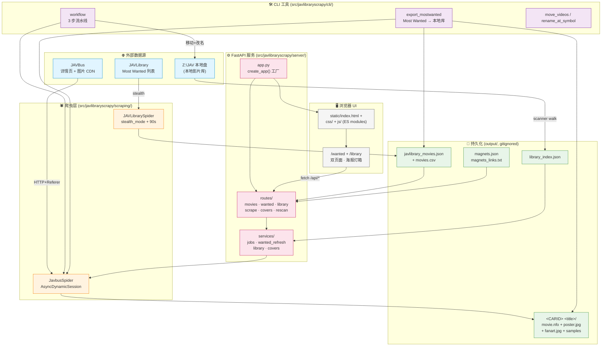
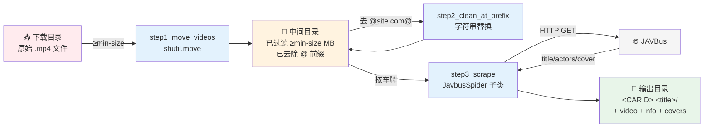

# 系统架构总览

> 项目的高层架构图与数据流。**只画边界和数据流向**，实现细节见 `CLAUDE.md` 和具体设计文档。

## 目录

- [1. 系统总览](#1-系统总览)
- [2. 端到端 workflow 数据流](#2-端到端-workflow-数据流)
- [3. 本地影片库数据流](#3-本地影片库数据流)
- [4. 画廊请求生命周期](#4-画廊请求生命周期)

---

## 1. 系统总览

四层结构：**爬虫（外网） → 持久化（output/） → 服务（FastAPI） → UI（浏览器）**。本地库作为正交子系统与所有层交互。

### Mermaid 图



### ASCII 备援（终端 / 不支持 Mermaid 的渲染器）

```
┌─────────────── 外部数据源 ───────────────┐
│  JAVBus (详情页/CDN)   JAVLibrary (列表)  │
│  Z:\JAV (本地影片库)                       │
└─────┬──────────────┬──────────────┬───────┘
      │              │              │
      ▼              ▼              │
┌─── 爬虫层 ─────────────────┐      │
│  JavbusSpider   JAVLibrarySpider    │
└────────────┬───────────────┘      │
             │                       │
┌─── CLI ─────▼──────────────────────┼──┐
│  workflow  export_mostwanted  move │  │
└────────────┬───────────────────────┘  │
             ▼                          │
┌─── 持久化 (output/, gitignored) ─────┼──┐
│  javlibrary_movies.{json,csv}         │  │
│  magnets.json + magnets_links.txt     │  │
│  library_index.json  ──◀ scanner ◀── ┘  │
│  <CARID> <title>/  movie.nfo + covers  │
└────────────┬──────────────────────────┘
             │
┌─── FastAPI ─▼──────────────────────────┐
│  app.py → routes/ → services/ → 爬虫    │
└────────────┬───────────────────────────┘
             │
┌─── UI ──────▼──────────────────────────┐
│  static/ (index.html + css/ + js/，双页面 /wanted + /library) │
└────────────────────────────────────────┘
```

### 模块边界

| 边界 | 接口 | 说明 |
| --- | --- | --- |
| 爬虫 � 持久化 | 文件路径 + JSON 字段 | 爬虫直接写 `output/`；不依赖 FastAPI |
| CLI ↔ 持久化 | 同上 | CLI 直接读写文件，与服务**无共享内存** |
| 服务 ↔ 持久化 | `output/javlibrary_movies.json` + `library_index.json` | 服务启动时按需加载；写操作走原子 `.tmp → rename` |
| 服务 ↔ 爬虫 | `JavbusSpider` / `JAVLibrarySpider` 公共方法 | 单实例任务锁防并发（详见 [`refresh-flows.md`](refresh-flows.md)） |
| UI ↔ 服务 | REST + StaticFiles | 前端**热加载**——改 `static/` 下任意文件刷新即生效（CSS/JS 走浏览器缓存 `If-Modified-Since`，HTML 走 `FileResponse`），不需要重启服务 |

---

## 2. 端到端 workflow 数据流

`cli/workflow.py` 的 3 步流水线：从下载目录到带 NFO 的本地库。

### Mermaid 图



### 关键约束

- `--preview` 仅执行 step 1–2，到 step 3 之前停止
- step 3 用 `JavbusSpider` 子类，**覆写 `process_movie()`** 把封面复制到子目录（而不是原地重命名）
- 排除列表 `HEYZO/PONDO/CARIB/OKYOHOT` 在 `find_car_bus` 里硬编码（这些在 JAVBus 上没页面）

---

## 3. 本地影片库数据流

从 `Z:\JAV` 扫描到画廊 `/library` 页面渲染。

### Mermaid 图

```mermaid
flowchart TB
    FS["Z:\JAV<br/>(本地文件系统)"]
    SC["library_scanner.py<br/>scan_library()"]
    IDX["output/library_index.json<br/>schema_version=1"]
    MEM["GalleryState.library_index<br/>(内存双向前缀匹配)"]
    API["/api/library<br/>/api/movies (附加 local_exists)"]
    PAGE["/library 页面<br/>/wanted 页面 badge"]

    FS -->|walk + 解析 NFO| SC
    SC -->|原子写 .tmp → rename| IDX
    IDX -->|load_index| MEM
    MEM -->|find_match()| API
    API --> PAGE

    classDef fs fill:#e1f5ff
    classDef store fill:#e8f5e9
    classDef mem fill:#fff3e0
    classDef api fill:#fce4ec
    classDef ui fill:#f5f5f5

    class FS fs
    class IDX store
    class MEM mem
    class API api
    class SC,PAGE ui
```

### 关键算法

**双向前缀匹配**（`a.startswith(b) or b.startswith(a)`）覆盖两种场景：
- 本地 `ABF-340-C` ↔ 远端 `ABF-340`（本地带后缀）
- 本地 `ABF` ↔ 远端 `ABF-340`（本地是前缀）

2000+ 部 O(N) 扫一遍亚毫秒，不做 bisect 也够。

**路径归一化**（commit `c0ab1d7`）：
- 用户传入 `LIBRARY_ROOT=Z:\JAV`，索引里可能存的是 `\\nas\JAV`（UNC）
- 启动 / 扫描 / 查询统一走规范化比较，避免「root 不一致 → 强制重扫」的误判

**扫描策略**（Q13 方案 a）：
- 遇到任一含视频文件的目录就停止深入（避免嵌套扫描）
- 重复车牌取 size 最大的文件夹为代表，其他记日志 + UI 顶部一次性横幅

---

## 4. 画廊请求生命周期

3 个典型请求的端到端调用链。

### Mermaid 图（sequence）

```mermaid
sequenceDiagram
    autonumber
    participant U as 🖥️ 浏览器
    participant T as static/index.html
    participant R as routes/*.py
    participant S as services/*.py
    participant J as JavbusSpider<br/>(异步)
    participant F as 📁 output/

    Note over U,F: 场景 A：抓取选中磁力 (POST /api/scrape)
    U->>T: 勾选车牌 + 点「抓取磁力」
    T->>R: POST /api/scrape {codes}
    R->>S: enqueue_scrape(codes)
    S->>S: 去重已存在本地<br/>→ skipped[]
    S->>S: new ScrapeJob<br/>+ 起 daemon 线程
    S-->>R: {job_id, skipped}
    R-->>T: 200 JSON
    T->>U: 右侧面板显示进度

    loop 每 1.5s 轮询
        U->>T: GET /api/scrape/status
        T->>R: forward
        R->>S: get_job_snapshot()
        S-->>R: {phase, current_code, done}
        R-->>T: snap
        T-->>U: 更新进度条 + 日志
    end

    par 后台线程
        S->>J: crawl_and_process(cars)
        J->>F: magnets.json + magnets_links.txt
        J-->>S: 完成
        S->>S: on_complete()
    end

    Note over U,F: 场景 B：手动刷新 (POST /api/wanted/refresh)
    U->>T: 点「🔄 手动刷新」
    T->>R: POST /api/wanted/refresh
    R->>S: WantedService.start_refresh()
    S-->>R: is_already_running?
    R-->>T: 409 or start

    S->>J: Phase 1: JAVLibrarySpider.crawl()
    J->>F: 更新 javlibrary_movies.json (merge)
    S->>J: Phase 3: JavbusSpider.parse() 每部
    J->>F: cover.jpg + sample_NNN.jpg → &lt;root&gt;/&lt;CARID&gt; &lt;title&gt;/
    S->>F: 原子写 javlibrary_movies.json
    S-->>T: 轮询直到 phase=done
```

### 路由层职责

`routes/` 模块**只做请求解析 + 响应包装**，业务逻辑全部下沉到 `services/`：

| routes/ | 服务调用 | 关键约束 |
| --- | --- | --- |
| `movies.py` | 读 `javlibrary_movies.json` | 附加 `local_exists` / `library_folder` |
| `wanted.py` | `wanted.refresh` + `wanted_refresh.refresh_wanted` | 4 phase 流水线 |
| `scrape.py` | `jobs.enqueue_scrape` | 单实例任务锁 |
| `rescan.py` | `library.start_rescan` / `enqueue_rescan` | 单实例 / 队列 |
| `library.py` | `library.*` | 双向前缀匹配查询 |
| `covers.py` | `covers.proxy_cover` | `.cover_cache/` 缓存 |
| `pages.py` | 模板渲染 | 从磁盘读，热加载 |
| `folder.py` | `os.startfile` | Windows-only |

---

## 相关文档

- 详细事实：[`CLAUDE.md`](../CLAUDE.md)
- 本地库算法：[`library-feature.md`](library-feature.md)
- 刷新流程细节：[`refresh-flows.md`](refresh-flows.md)
- 文档索引：[`docs/README.md`](README.md)
