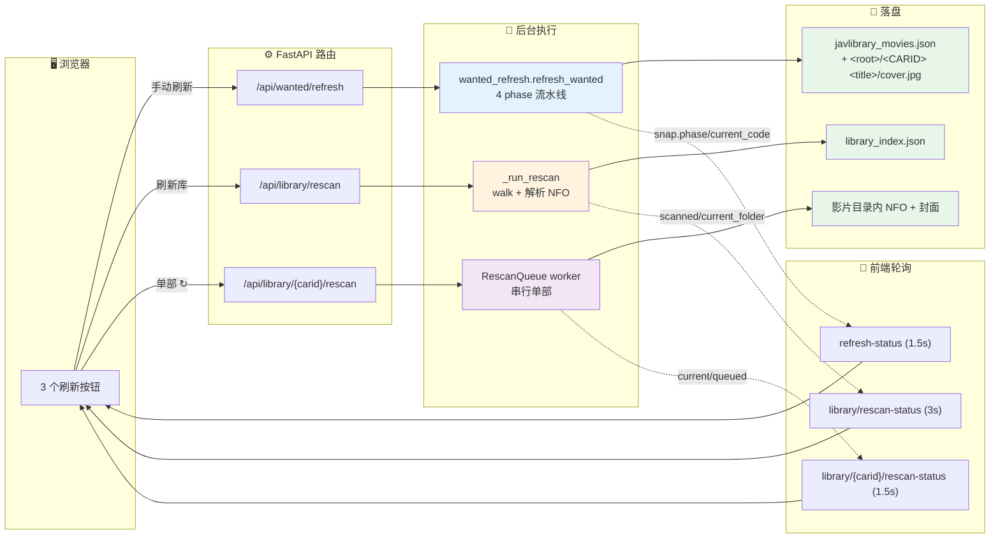

# 画廊刷新流程

画廊服务里一共有 **3 个刷新按钮**，每个触发不同的后端 pipeline。本文档逐个梳理
「前端点击 → API → 后台执行 → 落盘/回填 → 前端轮询」的完整链路。

> 服务入口：`src/javlibraryscrapy/cli/gallery.py`（包装 `python -m javlibraryscrapy.cli.gallery`）
> 前端：`src/javlibraryscrapy/static/`（`index.html` + `css/` + `js/`，零构建 ES modules），由 FastAPI `StaticFiles` 挂载在 `/static/`，改完刷新即生效

## 文档更新记录

| 日期 | 变更 |
| --- | --- |
| 2026-08-23 | 同步到 v1.x：服务已重构为 `src/javlibraryscrapy/server/` 包；本节路由 / 服务路径按当前代码标注。 |
| 2026-08-23 | 新增「关键 Commit」一节：`c0ab1d7`（路径归一化影响扫描启动判定）、`0471157`（单部刷新 + 双页面灯箱）、`45e0d9a`（磁链解析回退）。 |

## 关键 Commit

| Commit | 标题 | 影响本流程的点 |
| --- | --- | --- |
| `45e0d9a` | **磁链解析鲁棒性**：`_extract_magnet_link` 加全文正则回退 | 手动刷新 Phase 3 的 JAVBus 抓取对结构差异的画廊详情页不再漏抓 |
| `0471157` | **单部刷新 + 双页面灯箱**：`/api/library/{carid}/rescan` + `/wanted`/`/library` 共用灯箱 | 「↻ 单部刷新」按钮的入口；顶部导航；灯箱组件复用 |
| `c0ab1d7` | **路径归一化**：`LIBRARY_ROOT` vs 索引 root 比较时统一走 `normcase + realpath` | 「刷新库」启动时不再因映射盘 vs UNC 物理同卷而误判为 root 不一致 → 强制重扫 |

---

## 总览

| 按钮 | 位置 | API | 用途 | 耗时 |
| --- | --- | --- | --- | --- |
| 🔄 **手动刷新** | `/wanted` 顶栏 | `POST /api/wanted/refresh` | 拉 Most Wanted → 合并 → 抓 JAVBus 详情 | 5–15 分钟（全量） |
| **刷新库** | `/library` 顶栏 | `POST /api/library/rescan` | 递归扫描 `LIBRARY_ROOT`，重建索引 | 取决于库大小（数百部秒级） |
| ↻ 卡片角 | `/library` 卡片左上 | `POST /api/library/{carid}/rescan` | 单部：重抓 NFO + 封面（队列逐个） | 5–10 秒/部 |

并发约束：
- 三类刷新**彼此独立**，可以同时跑（不同后台线程）。
- 「手动刷新」**单实例**——再触发返回 `is_already_running=true`。
- 「刷新库」**单实例**——再触发返回 HTTP 409。
- 「单部刷新」**队列**——重复点击同一部会入队或标记 `already`；不同车可以同时入队，但 worker 一次只处理一部。

### Mermaid 总览



---

## 1. 🔄 手动刷新（`/wanted` 顶栏）

**端点：** `POST /api/wanted/refresh`（body 可选 `{ "max_pages": N }`，不传 = 整站抓）

### 流程

```
┌─────────────────┐
│ 前端点击        │
│ btn-refresh     │
└──────┬──────────┘
       │ fetch('/api/wanted/refresh', { method: 'POST' })
       ▼
┌──────────────────────────────────────────────┐
│ routes/wanted_refresh.py:register            │
│   refresh() → wanted.start_refresh()         │
└──────┬───────────────────────────────────────┘
       │
       ▼
┌──────────────────────────────────────────────┐
│ services/wanted.py:WantedService             │
│   1. 检查 self.job 是否 running              │
│      - 是 → 返回 is_already_running=true     │
│      - 否 → new_job() + 起后台线程           │
└──────┬───────────────────────────────────────┘
       │
       ▼ 后台线程（daemon=True）
┌──────────────────────────────────────────────┐
│ services/wanted_refresh.py:refresh_wanted    │
│                                              │
│ Phase 1: fetch_wanted                        │
│   - JAVLibrarySpider.crawl()                 │
│   - 拉所有页（间隔 3 秒）                     │
│   - job.wanted_total = 总页数                │
│   - 每页完 → job.wanted_pages_done++         │
│                                              │
│ Phase 2: merge                               │
│   - 读 output/javlibrary_movies.json         │
│   - merge_wanted(remote, local)              │
│     · 新增 → 标 _status=pending              │
│     · 已有 → 更新 title/cover_url            │
│     · 远端消失 → 标 missing_in_remote=true   │
│       （**不删**，保留历史）                  │
│   - job.{wanted_added, wanted_updated, ...}  │
│                                              │
│ Phase 3: fetch_javbus                        │
│   - 对所有 _status=pending 的车逐个跑        │
│     JavbusSpider.parse()（间隔 1.5 秒）      │
│   - parse() 提取 cover + samples URL 列表    │
│   - 填 release_date / actors / producer /   │
│     publisher / category / _bucket           │
│   - 成功 → _status=ready                     │
│   - 失败 → _status=failed + javbus_failed++  │
│   - 若 MOSTWANTED_LIBRARY_ROOT 设了：         │
│     _save_per_movie_folder() 把 cover →      │
│     cover.jpg、samples → sample_NNN.jpg      │
│     到 <root>/<CARID> <title>/               │
│   - 计数：local_saved / local_skipped        │
│                                              │
│ Phase 4: save                                │
│   - 原子写：.tmp → rename 到                 │
│     output/javlibrary_movies.json            │
│   - on_complete() → WantedService.reload()   │
│     重新从磁盘加载到内存                     │
└──────┬───────────────────────────────────────┘
       │
       ▼
┌──────────────────────────────────────────────┐
│ 前端轮询（每 1.5s）                          │
│   GET /api/wanted/refresh-status             │
│   - snap.status: running | done              │
│   - snap.phase: fetch_wanted / merge / ...   │
│   - snap.{wanted_total, wanted_pages_done,   │
│     wanted_added, wanted_updated,            │
│     javbus_total, javbus_done, javbus_failed}│
│   - snap.current_code: 正在抓的车牌         │
│   - snap.local_saved / local_skipped:        │
│     本地库落地统计                            │
│                                              │
│ status=done 时：                              │
│   - 清轮询，重新 load()                      │
│   - phase=error → toast 失败原因            │
│   - phase=done  → 静默刷新（看 last-refresh）│
└──────────────────────────────────────────────┘
```

### 输出文件

- `output/javlibrary_movies.json`（每部含 `code / title / cover_url / release_date / actors / producer / publisher / category / _status / _bucket / _seen_at / _updated_at / missing_in_remote`）。**若 `.env` 的 `MOSTWANTED_LIBRARY_ROOT` 非空，路径改为 `<root>/javlibrary_movies.json`**（与每部影片的 cover/samples 同根目录）。
- **本地库落地**（仅当 `.env` 的 `MOSTWANTED_LIBRARY_ROOT` 非空时）：
  - 每部 → `<root>/<CARID> <title>/cover.jpg`（JAVBus 主封面）
  - 每部 → `<root>/<CARID> <title>/sample_NNN.jpg`（JAVBus 樣品圖像，按 URL 顺序编号）

### Phase 3 内的本地库落地细节

```
JavbusSpider.parse() 返回 info
  ├─ info["cover"]: Path （已下到 <MOSTWANTED_LIBRARY_ROOT>/<CARID>.png）
  ├─ info["samples"]: List[str] （#sample-waterfall a.sample-box[href] URL 列表）
  │
  └─ _save_per_movie_folder(spider, info, code, mw_root):
       1. <root>/<CARID> <title>/.mkdir(exist_ok=True)
       2. cover.png → cover.jpg（已存在则跳过；未在 root 则只清临时）
       3. download_samples(samples, code) → <root>/<CARID>_sample_NNN.jpg
       4. sample_NNN.jpg → <folder>/sample_NNN.jpg（已存在则跳过）
       5. 清残留 <CARID>_sample_*.jpg
       6. 返回 {cover: 0/1, samples: N}
```

`job` 新增 `local_saved` / `local_skipped` 两个字段，前端轮询可见（`/api/wanted/refresh-status` 返回）。

### 关键代码位置

- 前端：`src/javlibraryscrapy/static/js/wanted.js`（`startRefresh` / `pollRefreshStatus`）
- 路由：`src/javlibraryscrapy/server/routes/wanted.py:46-63`
- 服务：`src/javlibraryscrapy/server/services/wanted.py:156-183`（任务管理）
- Pipeline：`src/javlibraryscrapy/server/services/wanted_refresh.py:201-`（4 phase 主编排）
- Merge 逻辑：`src/javlibraryscrapy/server/services/wanted_refresh.py:129-195`
- 本地库落地：`src/javlibraryscrapy/server/services/wanted_refresh.py:_save_per_movie_folder`
- JAVBus 解析：`javlibraryscrapy.scraping.javbus:parse()`（samples 提取）、`javlibraryscrapy.scraping.javbus:download_samples()`

### 排错要点

- **Cloudflare 拦截**：JAVLibrary 用 `stealth_mode=True` + 90s 超时；JAVBus 用 `disable_resources=True` + 30s。代理需在 `.env` 配 `PROXY_ENABLED=true` + `PROXY=...`。
- **进程崩溃 / 异常**：job 标 `phase=error`，前端 toast 提示 `snap.error`。本地 JSON 保留中断前已 merge 的内容。
- **重跑**：直接再点按钮即可（同一 job 不复用）；会基于磁盘 JSON 增量合并。

---

## 2. 刷新库（`/library` 顶栏）

**端点：** `POST /api/library/rescan`

### 流程

```
┌─────────────────┐
│ 前端点击        │
│ btn-lib-rescan  │
└──────┬──────────┘
       │ fetch('/api/library/rescan', { method: 'POST' })
       ▼
┌──────────────────────────────────────────────┐
│ routes/rescan.py:register                    │
│   trigger_rescan() → state.start_rescan()    │
│   校验：library_root 是否配置                 │
└──────┬───────────────────────────────────────┘
       │
       ▼
┌──────────────────────────────────────────────┐
│ services/library.py:GalleryState             │
│   start_rescan()                             │
│   - 加锁；检查 scan_state.is_running         │
│   - 在跑 → 返回 False → HTTP 409            │
│   - 否则 → ScanProgress(is_running=True)     │
│           + 启动后台线程                     │
└──────┬───────────────────────────────────────┘
       │
       ▼ 后台线程
┌──────────────────────────────────────────────┐
│ _run_rescan()                                │
│                                              │
│ 1. scan_library(library_root, progress)     │
│    - Phase 1：walk root，收集所有            │
│      含视频的目录（停止深入）                 │
│    - Phase 2：对每部目录 → scan_movie_folder│
│      · 解析车牌 _parse_carid()              │
│      · 读 NFO → title/actors/release_date   │
│      · 找 cover/fanart/video                │
│    - 重复车牌：保留 size 最大的              │
│    - 同步写 scan_state.scanned/current_folder│
│                                              │
│ 2. save_index()                              │
│    - 原子写：output/library_index.json       │
│      schema_version=1                        │
│    - 写入 root（规范化）、scanned_at、stats  │
│                                              │
│ 3. load_index() → LibraryIndex.from_dict()   │
│    - 替换 self.library_index                 │
│    - 更新 library_stats / library_scanned_at│
│                                              │
│ 4. scan_state.is_complete=True               │
│    scan_state.is_running=False               │
└──────┬───────────────────────────────────────┘
       │
       ▼
┌──────────────────────────────────────────────┐
│ 前端轮询（每 3s，由 loadStatus 驱动）        │
│   GET /api/library/rescan-status            │
│   - data.is_running / scanned / total_estimate│
│   - data.current_folder: 正在扫的目录        │
│   - data.is_complete / data.error            │
│                                              │
│ 状态恢复后 → load() 重拉列表                │
│ - "上次扫描 YYYY-MM-DD HH:MM"               │
│ - error 时 → banner.error                    │
└──────────────────────────────────────────────┘
```

### 输出文件

- `output/library_index.json`（schema_version=1，根 = `{"schema_version", "scanned_at", "root", "scan_duration_seconds", "stats", "movies": {carid: MovieEntry}}`）
- 内存中替换 `GalleryState.library_index`（双向前缀匹配 `find_match()`）

### 关键代码位置

- 前端：`src/javlibraryscrapy/static/js/library.js`（按钮 handler + loadStatus 渲染）
- 路由：`src/javlibraryscrapy/server/routes/rescan.py:21-28`
- 服务：`src/javlibraryscrapy/server/services/library.py:188-223`（`start_rescan` / `_run_rescan`）
- 扫描器：`src/javlibraryscrapy/library/scanner.py`（`scan_library` / `save_index` / `load_index` / `LibraryIndex`）

### 排错要点

- **索引与 root 不一致**：启动时 `_maybe_load_library_index()` 会比较规范化路径，不一致则丢弃旧索引、等待手动刷新（`src/javlibraryscrapy/server/services/library.py:159-186`）。
- **大库性能**：扫描是单线程 walk IO 密集型；目前没有 cancel 接口（`ScanProgress.cancel_event` 字段保留但未接线）。
- **NoRescanOnStartup**：服务启动时索引缺失/root 不一致**不会**自动扫描（除非 `PROXY_ENABLED=true` 之类有副作用逻辑变化）。要重新扫必须手动点。

---

## 3. ↻ 单部刷新（`/library` 卡片左上角）

**端点：** `POST /api/library/{carid}/rescan`

**只对 `has_video=True` 的卡片显示刷新按钮**（没视频没东西可刷）。

### 流程

```
┌─────────────────┐
│ 前端点击        │
│ .rescan-btn     │
│ (carid)         │
└──────┬──────────┘
       │ fetch('/api/library/{carid}/rescan', { method: 'POST' })
       ▼
┌──────────────────────────────────────────────┐
│ routes/rescan.py:register                    │
│   enqueue_rescan(carid)                      │
│   校验：                                      │
│   - CARID_RE 匹配（[A-Z0-9_-]{2,32}）        │
│   - library_root 已配置                       │
└──────┬───────────────────────────────────────┘
       │
       ▼
┌──────────────────────────────────────────────┐
│ services/library.py:GalleryState             │
│   enqueue_rescan_movie(carid)                │
│   - 查 library_index.get(carid)              │
│     · 不存在 → 404 "本地库中未找到车牌"     │
│   - 检查 has_video                           │
│     · 没视频 → 404 "该目录下未找到视频文件" │
│   - 调 self.rescan_queue.enqueue(carid, folder)│
└──────┬───────────────────────────────────────┘
       │
       ▼ 后台 worker 线程（启动时 start_worker）
┌──────────────────────────────────────────────┐
│ services/jobs.py:RescanQueue                 │
│   - 串行执行：一次只跑一部                   │
│   - 重复入队：返回 {already: true, position}│
│     或 {running: true}                       │
│                                              │
│   每部执行：                                  │
│   1. JavbusSpider(root_dir=library_root)     │
│   2. AsyncDynamicSession 拉详情页            │
│      （stealth + 90s timeout，与 wanted 同） │
│   3. parse() → release_date/actors/...      │
│   4. download_cover() → fanart.jpg           │
│   5. split_poster_from_fanart → poster.jpg   │
│   6. write_xml() → movie.nfo                 │
│   7. rename 视频文件到 <CARID> <title>.<ext>│
│   8. 完成 → on_complete 回调：               │
│        GalleryState._refresh_index_after_rescan│
│        → scan_movie_folder(folder) 增量更新  │
│        → library_index.upsert(entry)         │
└──────┬───────────────────────────────────────┘
       │
       ▼
┌──────────────────────────────────────────────┐
│ 前端轮询（每 1.5s）                          │
│   GET /api/library/rescan-status            │
│   返回：                                      │
│   - current: { carid, status, ... }         │
│     （正在跑的那部）                          │
│   - queued: [ { carid, position, ... }, ... ]│
│     （队列里的，按位置排序）                  │
│   - total: 队列总长                          │
│                                              │
│ 按钮状态：                                    │
│   - .running: 当前正在处理（黄色脉冲）       │
│   - .queued:  在队列里（灰色）               │
│   - .done:    刚完成（绿色，2s 后复位）      │
└──────────────────────────────────────────────┘
```

### 输出文件

- 原地修改本地库目录：
  - 新建/覆写 `movie.nfo`（JAVBus 元数据）
  - 新建/覆写 `fanart.jpg` + `poster.png`（poster 从 fanart 右侧裁剪）
  - 重命名视频文件为 `<CARID> <title>.<ext>`
- 增量更新 `output/library_index.json`（不重扫全库，只更新该部）

### 关键代码位置

- 前端：`src/javlibraryscrapy/static/js/library.js`（按钮 handler + 状态轮询）
- 路由：`src/javlibraryscrapy/server/routes/rescan.py:35-70`（`{carid}/rescan` + 返回 `already/running/position`）
- 服务：`src/javlibraryscrapy/server/services/library.py:226-248`
- 队列：`src/javlibraryscrapy/server/services/jobs.py:RescanQueue`
- 单部重扫：`src/javlibraryscrapy/scraping/javbus.py:JavbusSpider.crawl_and_process`（被复用）

### 排错要点

- **车在本地库不存在**：404。前端会 toast 错误。常见原因：手动复制了车但没建索引。
- **车在 JAVBus 上不存在**（`HEYZO/PONDO/CARIB/OKYOHOT`）：parse 失败 → 标 `_status=failed`，NFO 不会被写。
- **重复点击同一部**：返回 `already=true` + position。状态由后端统一，前端只反映。
- **worker 跑挂了**：job 状态机保留 `failed`；队列继续走下一部。日志写到 `output/.gallery_server.log`。

---

## 三者的差异速查

| 维度 | 🔄 手动刷新 | 刷新库 | ↻ 单部 |
| --- | --- | --- | --- |
| 触发器 | `/wanted` 顶栏 | `/library` 顶栏 | `/library` 卡片角 |
| 抓什么 | 远端 Most Wanted + JAVBus 详情 | 本地 `LIBRARY_ROOT` walk | JAVBus 详情（单部） |
| 写什么 | `output/javlibrary_movies.json` | `output/library_index.json` | 影片目录内 NFO/封面/视频 |
| 并发 | 单实例（job） | 单实例（scan_state） | 队列（worker 串行） |
| 状态字段 | `phase / current_code` | `scanned / current_folder` | `current / queued` |
| 失败恢复 | 保留已 merge；可重跑 | 全量重扫 | 单部重试或跳过 |
| 典型耗时 | 5–15 min（全量） | 几秒（数百部） | 5–10 s/部 |

---

## 相关文档

- 画廊架构：`CLAUDE.md`（重点看「`src/javlibraryscrapy/server/`」一节）
- 本地库索引格式：`docs/library-feature.md`
- Wanted 月份桶设计：见 `src/javlibraryscrapy/server/services/wanted_refresh.py` 顶部 docstring
- 调试脚本：`tests/integration/test_rescan_queue.py`（队列）/ `tests/integration/test_gallery_server_library.py`（整合）
